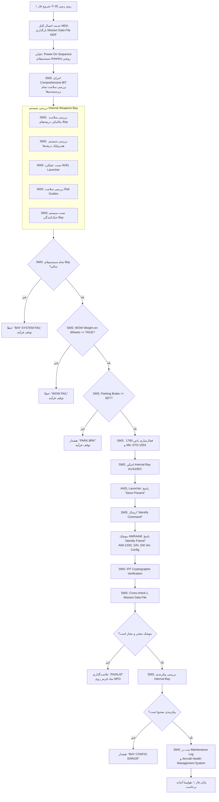

# فلوچارت شلیک موشک AMRAAM از F-35

## فاز ۱: آماده‌سازی و راه‌اندازی

```mermaid
flowchart TD
    A[شروع فاز ۱: F-35 روی زمین] --> B[خدمه: اتصال کابل MDA<br>بارگذاری Mission Data File MDF]
    B --> C[خلبان: Power-On Sequence<br>سیستم‌های Avionics روشن]
    C --> D[SMS: اجرای Comprehensive BIT<br>بررسی سلامت تمام زیرسیستم‌ها]
    
    subgraph E[بررسی سیستم Internal Weapons Bay]
        E1[SMS: بررسی سلامت مکانیکی دریچه‌های Bay]
        E2[SMS: بررسی سیستم هیدرولیک دریچه‌ها]
        E3[SMS: تست عملکرد AVEL Launcher]
        E4[SMS: بررسی سلامت Rail Guides]
        E5[SMS: تست سیستم خنک‌کنندگی Bay]
    end
    
    D --> E
    E --> F{SMS: تمام سیستم‌های Bay سالم؟}
    F -- خیر --> G[خطا: “BAY SYSTEM FAIL”<br>توقف فرآیند]
    F -- بله --> H{SMS: WOW Weight-on-Wheels == TRUE?}
    H -- خیر --> I[خطا: “WOW FAIL”<br>توقف فرآیند]
    H -- بله --> J{SMS: Parking Brake == SET?}
    J -- خیر --> K[هشدار: “PARK BRK”<br>توقف فرآیند]
    J -- بله --> L[SMS: فعال‌سازی باس 1760 و MIL-STD-1553]
    L --> M[SMS: اسکن Internal Bay A1/A2/B/C]
    M --> N[AVEL Launcher: پاسخ “Store Present”]
    N --> O[SMS: ارسال “Identify Command”]
    O --> P[موشک AMRAAM: پاسخ “Identify Friend”<br>AIM-120D, S/N, SW Ver, Config]
    P --> Q[SMS: IFF Cryptographic Verification]
    Q --> R[SMS: Cross-check با Mission Data File]
    R --> S{موشک معتبر و مجاز است؟}
    S -- خیر --> T[علامت‌گذاری “INVALID”<br>نماد قرمز روی MFD]
    S -- بله --> U[SMS: بررسی پیکربندی Internal Bay]
    U --> V{پیکربندی صحیح است؟}
    V -- خیر --> W[هشدار: “BAY CONFIG ERROR”]
    V -- بله --> X[SMS: ثبت در Maintenance Log<br>و Aircraft Health Management System]
    X --> Y[پایان فاز ۱: هواپیما آماده برخاست]
```

## فاز ۲: همگام‌سازی و پرواز

```mermaid
flowchart TD
    A[شروع فاز ۲: برخاستن F-35] --> B[سنسورها: WoffW = FALSE]
    B --> C[SMS: رها کردن قفل ایمنی Ground Safe Mode]
    C --> D[SMS: اعمال Power Application 1 PA1<br>28V DC & 115V 400Hz AC]
    D --> E[موشک: بوت سیستم + اجرای Comprehensive PBIT]
    E --> F[SMS: پرس‌وجوی وضعیت موشک]
    F --> G[موشک: “Extended Status Word”<br>PBIT Results, HW/SW Health, Ready State]
    G --> H{موشک کاملاً سالم است؟}
    H -- خیر --> I[علامت‌گذاری “NO-GO”<br>نماد زرد/قرمز روی MFD]
    H -- بله --> J[SMS: فعال‌سازی Integrated RF Coupling System]
    
    subgraph K[تست پیشرفته سیستم‌های موشک در Bay بسته]
        K1[SMS: فعال‌سازی Digital RF Target Simulator]
        K2[Target Simulator: تولید سیگنالهای تست Realistic<br>با پارامترهای RCS, Doppler, Range]
        K3[RF Coupling System: ارسال سیگنال به سیکر موشک<br>از طریق Couplerهای دیواره Bay]
        K4[موشک: پردازش سیگنال + اجرای Seeker BIT]
        K5[موشک: ارسال نتایج تست via RF Return Path]
        K6[SMS: تحلیل عملکرد سیکر<br>حساسیت، دقت، نویز]
        K7{سیکر عملکرد مطلوب دارد؟}
        K7 -- خیر --> K8[خطا: “SEEKER PERFORMANCE DEGRADED”]
        K7 -- بله --> K9[تست دیتالینک via Wired Connection]
        K10{دیتالینک کاملاً سالم است؟}
        K10 -- خیر --> K11[خطا: “DATA LINK INTEGRITY FAIL”]
        K10 -- بله --> K12[تست آنتن‌های موشک via Coupling]
        K13{تمام آنتن‌ها عملکرد صحیح دارند؟}
        K13 -- خیر --> K14[خطا: “ANTENNA COUPLING FAIL”]
        K13 -- بله --> K15[تست موفق تمام سیستم‌ها]
    end
    
    J --> K
    K --> L[SMS: غیرفعال کردن تست سیستم‌ها]
    L --> M[MC: آغاز GPS/INS Bridging System]
    
    subgraph M_sub[سیستم GPS/INS Bridging پیشرفته]
        M1[هواپیما: دریافت سیگنال GPS/GNSS چند منظوره<br>GPS, GLONASS, Galileo]
        M2[F-35 EGI: محاسبه موقعیت دقیق با Sensor Fusion<br>GPS + INS + Star Tracker]
        M3[MC: تولید داده ناوبری شبیه‌سازی شده<br>با فرمت استاندارد GPS]
        M4[MC: ارسال داده به موشک via 1760 Bus]
        M5[موشک: اجرای فیلتر کالمن پیشرفته<br>با داده شبیه‌سازی شده]
        M6[MC: مانیتورینگ Integrity GPS Bridging<br>RAIM Algorithm]
        M7{دقت Bridging بهتر از 1 متر CEP است؟}
        M7 -- خیر --> M8[هشدار: “GPS BRIDGING DEGRADED”]
        M7 -- بله --> M9[Bridging فعال و پایدار]
    end
    
    M --> N[MC: شروع Initial Transfer Alignment ITA<br>نرخ 50Hz برای 15 ثانیه]
    N --> O[MC: کاهش نرخ به Periodic T.A. PTA 5Hz]
    O --> P[MC: ارسال Moment Arm Correction<br>براساس موقعیت دقیق موشک در Bay]
    P --> Q[MC: انتقال کلیدهای رمز D/L Keys]
    Q --> R[MC: محاسبه اثرات باد و شرایط جوی]
    R --> S[خلبان: Master Arm → ON]
    S --> T[خلبان: Sensor Control → A/A]
    T --> U[HUD: فعال‌سازی حالت A/A + نمادهای شلیک]
    U --> V[خلبان: انتخاب موشک AMRAAM روی MFD<br>از لیست Stores Management]
    V --> W[SMS: علامت‌زنی “Selected” + به‌روزرسانی اولویت]
    W --> X[پایان فاز ۲: موشک آماده درگیری]
```
